# The Great TikZlings Christmas Extravaganza 2019

This repository contains the souce code of the Great TikZlings Extravanganza 2019, created by [Ulrike](https://github.com/u-fischer) & [Gert Fischer](https://github.com/g-fischer), [CarLaTeX](https://github.com/CarLaTeX), [Paulo Cereda](https://github.com/cereda) and [samcarter](https://github.com/samcarter).

The full video is available from https://vimeo.com/380684973

### Silent night (organ music)

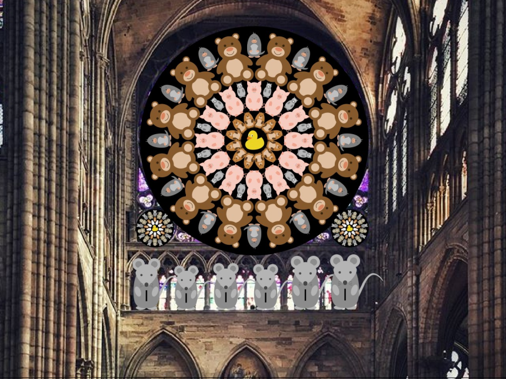

- Topic: Tikzling choir in front of rose window

- Music: https://www.youtube.com/watch?v=MbhxZOOXLvU - King's singers - 1.14

- Source code: ./Ulrike/choir/

### Bat out of hell

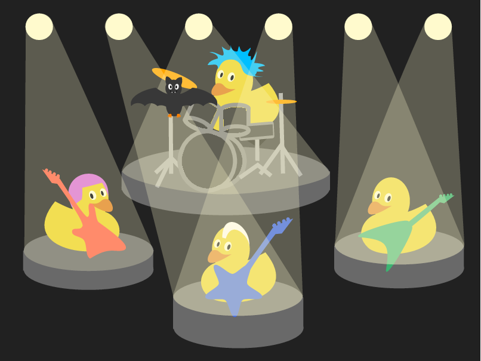

- Topic: Rockband/swirling bat

- Musik: https://www.youtube.com/watch?v=Q9hLcRU5wE4 - Meat Loaf - Bat Out of Hell - 2:55 - 3:20 

- Source code: ./samcarter/bat/

### Hippos

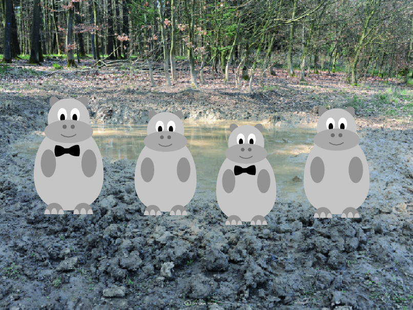

- Topic: Four Hippos (2 male, 2 female)

- Music: https://www.youtube.com/watch?v=3BPcImSZG8E - BBC Proms 2011 Comedy Proms Hippopotamus Song (Flanders & Swann) - 1:00 - 1:20 

- Source code: ./Ulrike/Hippos/

### It's time to say goodbye

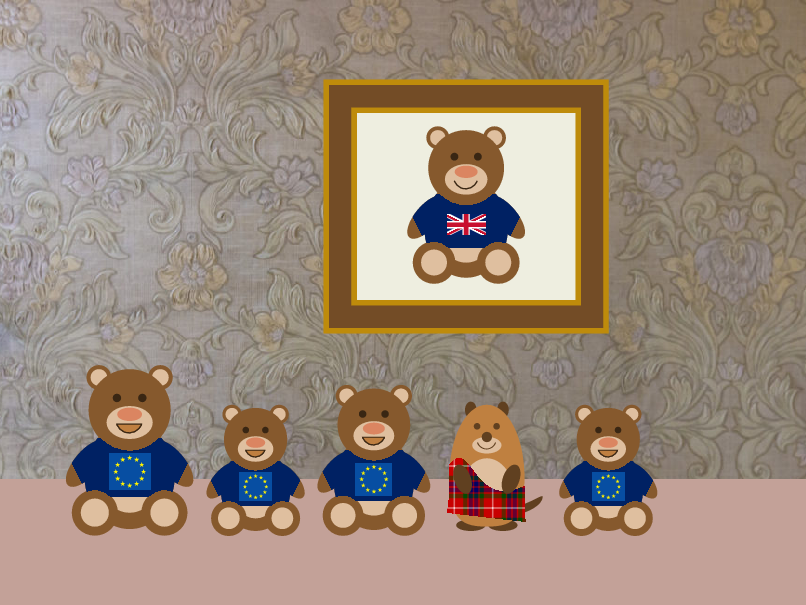

- Topic: (not sure about this ..., a bit depressing)

- Music: https://youtu.be/tL4spj1_trI - Auld Lang Syne - Norman Luboff Choir - 0:10 - 0:37

- Source code: ./ulrike/goodbye/

### Wild West Marmot

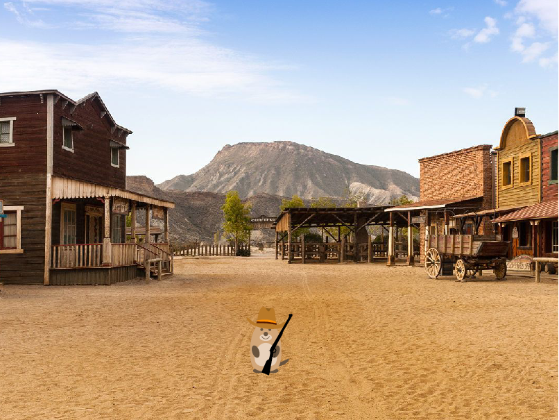

- Topic: Western town with marmot, background https://s-media-cache-ak0.pinimg.com/originals/5a/03/a5/5a03a528bae24b828b93524038952adc.jpg

- Music: https://youtu.be/31zZL0V3r94 - Sequenz Mundharmonika - 1:30 - 1:48

- Source code: ./Ulrike/WildWest/

### Museum

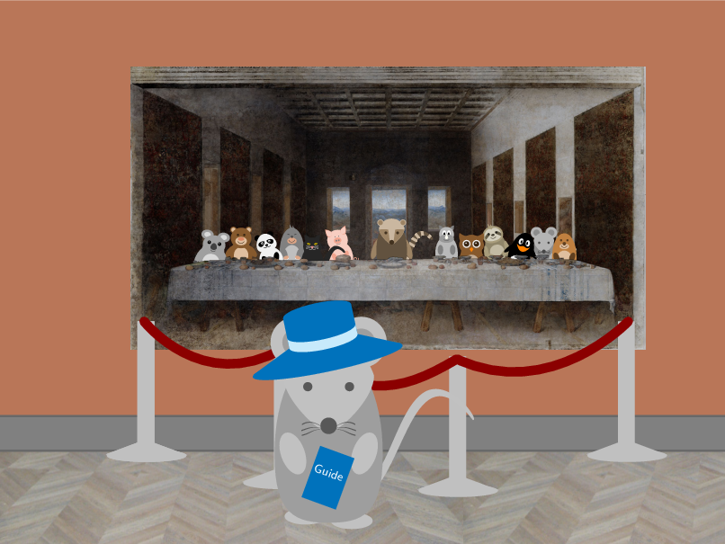

- Topic: a tikzling strolls through an art museum (sequal to last year)

- Music: https://youtu.be/D5qgD5oJ_NE - Pictures at an Exhibition - 0.50

- Source code: ./samcarter/Museum/

### CTAN factory

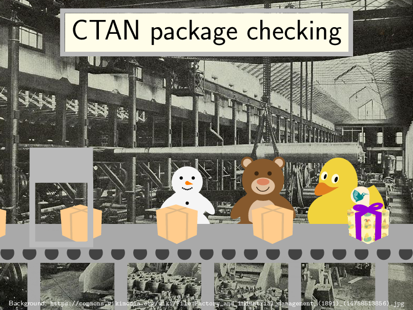

- Topic: A celebration of the CTAN team 

- Music: https://youtu.be/-Ih0JJLoMIg - Factory Sounds 

- Source code: ./samcarter/Ctan/

### And now for something different

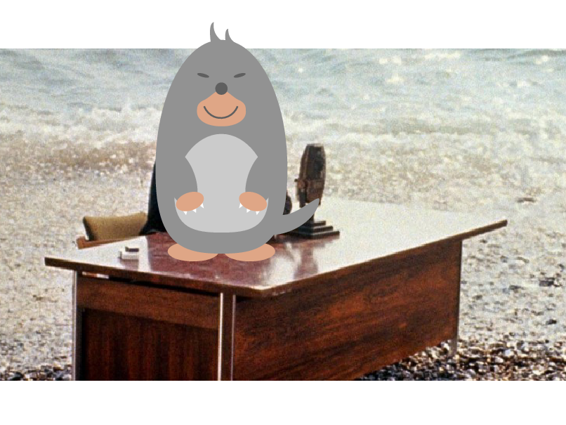

- And Now For Something Completely Different

- Music: https://youtu.be/Zk-kQSz-Qv0 - And Now For Something Completely Different

- Source code: ./ulrike/intermission/extravaganza-intermission-different-tug.tex

### TUG / Rochester

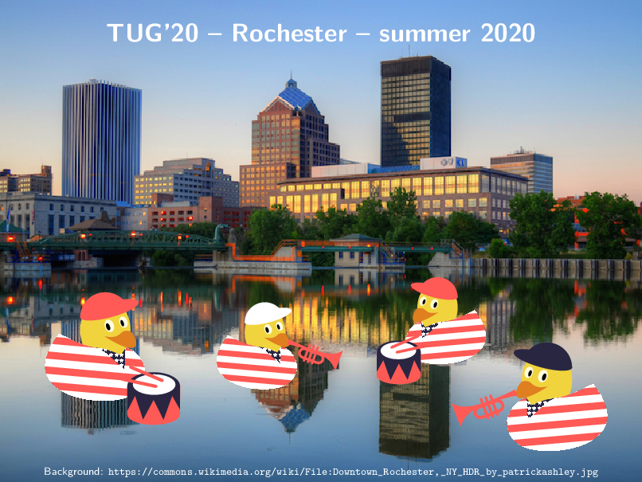

- Topic: Advertisement for TUG20: ~~marching~~ swimming band of ducks in front of the Rochester skyline

- Music: https://youtu.be/6HOc9WVZbts - Yankee Doodle - 0:36 - 0:50

- Source code: ./samcarter/tug/

### Island

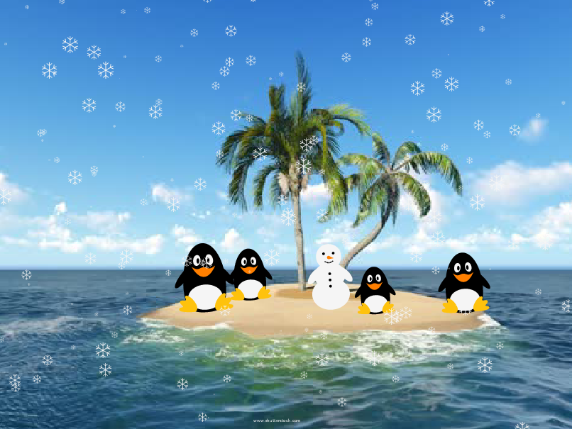

- Topic: Sunny usland with palm tree, Snowman and penguins singing let is snow (it should then snow ...)

- Music: https://youtu.be/vpyxTFqYHhE - Dean Martin - Let it Snow! Let it Snow! Let it Snow! - 0:08 - 0:20 

- Source code: ./Ulrike/Island/

### Bella Italia

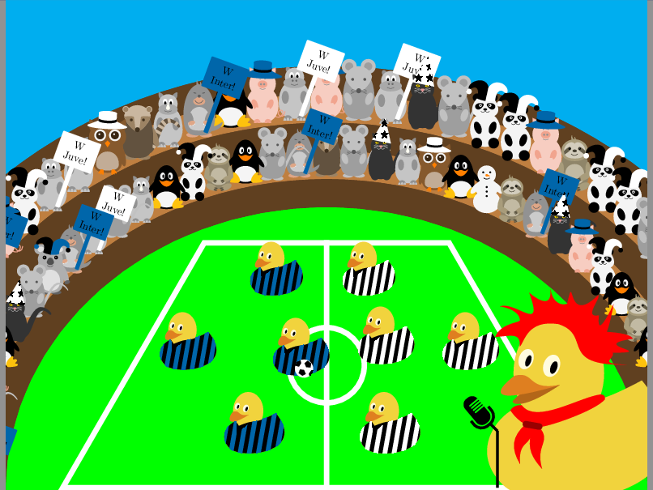

- Topic: Football in the middle; Gianna Nannini on top; football ducks around singing 

- Music:  https://youtu.be/9oU2XCi7fQA - Un'estate italiana - Gianna Nannini & Edoardo Bennato - 1:25 - 1:55

- Source code: ./Carla/Bella_Italia/

### Twitter

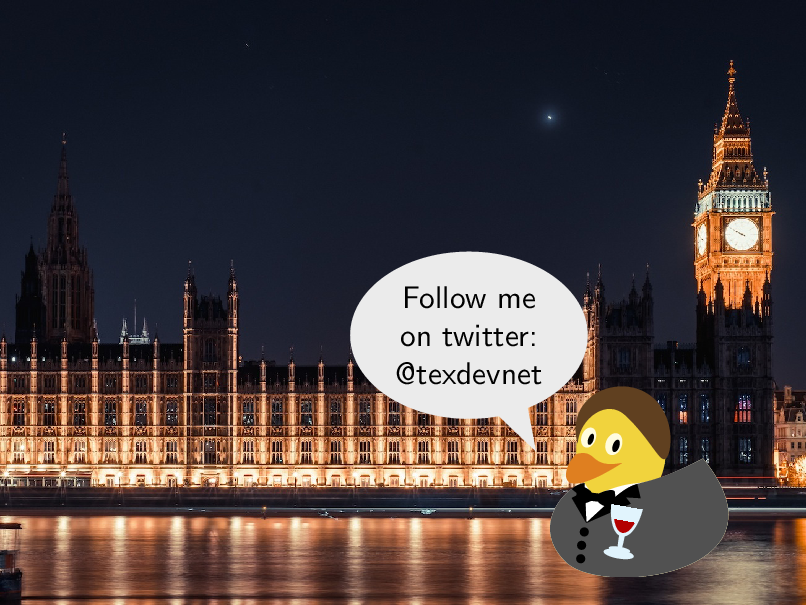

- Topic: follow the @texdevnet channel on twitter

- Music: https://www.youtube.com/watch?v=wqslA_CKub8 - The chimes of Big Ben  - 00:00:15 

- Source code: ./samcarter/twitter/

### Cats / Remembering

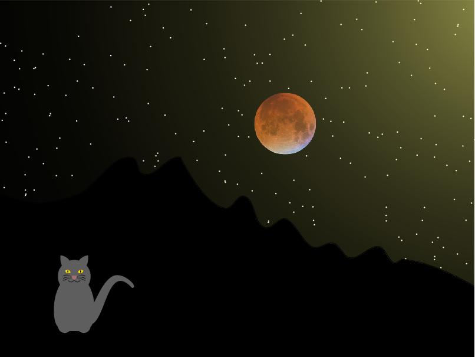

- Topic: Night sky, large moon with a mouse, a cat singing memories.

- Music: https://youtu.be/8gd_ohoPzYc - Memory - Cats the Musical - 0:00 - 0:20 

- Source code: ./samcarter/Cats/

### Particle Man

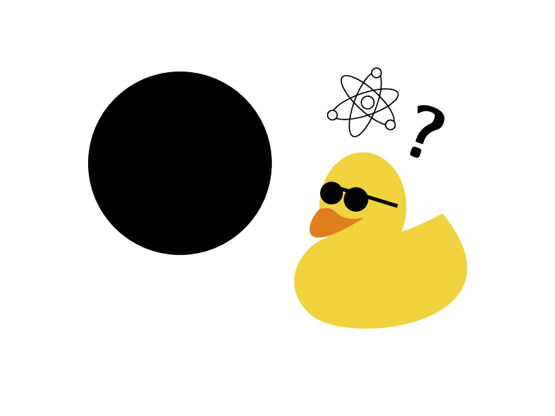

- Topic:  

- Music: 

- Source code: ./Paulo/particleman/

### Night divine 

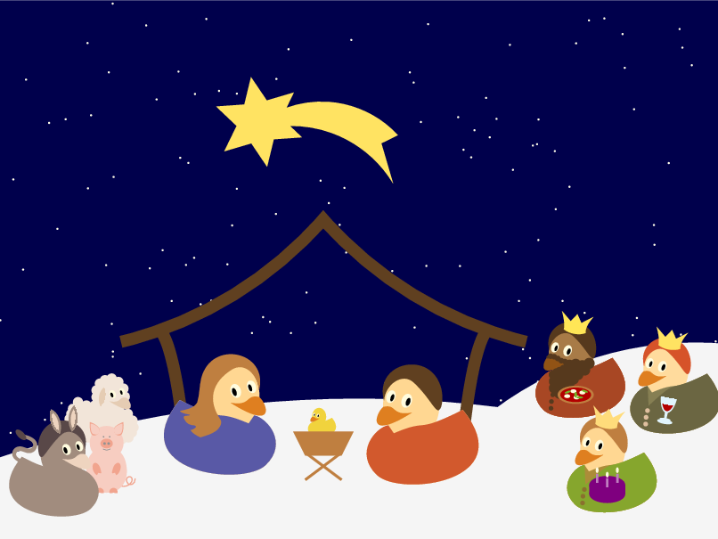

- Topic: nativity scene with ducks 

- Music: https://youtu.be/or2mMJ6_YCM - NAT KING COLE - O HOLY NIGHT - 0:06 - 0:23 

- Source code: ./samcarter/NightDivine/

### Finale

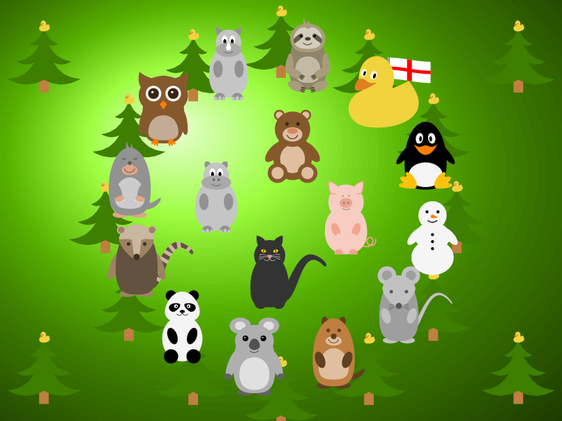

- Topic: traditional round of tikzlings

- Music: https://youtu.be/h_5rpntGmwo - We wish you a merry Christmas - Wiesbadener Knabenchor - 0:08 - 0:27

- Source code: ./Ulrike/Finale/
