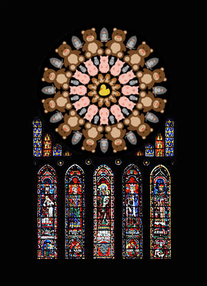

# The Great TikZlings Christmas Extravaganza 2019

This repository contains the souce code of the Great TikZlings Extravanganza 2019, created by [Ulrike](https://github.com/u-fischer) & [Gert Fischer](https://github.com/g-fischer), [CarLaTeX](https://github.com/CarLaTeX), [Paulo Cereda](https://github.com/cereda) and [samcarter](https://github.com/samcarter).

The full video is available from ...

<!--- 
Music and 3rd party images are not included in this repository. The links to the songs can be found in the file ./Storyboard2019/music.txt, links to 3rd party images are for the most part given in the code of the individual scenes.
--->

# First ideas:

[link to pdf](./Storyboard/drafts/Extravaganza2019_storyboard.pdf)

# Finished scenes:

### Bella Italia

- Topic: Football in the middle; Gianna Nannini on top; football ducks around singing 

- Music:  https://youtu.be/9oU2XCi7fQA - Un'estate italiana - Gianna Nannini & Edoardo Bennato - 1:25 - 1:55

- Source code: ./Carla/Bella_Italia/

### Finale

- Topic: traditional round of tikzlings

- Music: https://youtu.be/h_5rpntGmwo - We wish you a merry Christmas - Wiesbadener Knabenchor - 0:08 - 0:27

- Source code: ./Ulrike/Finale/

### Island

- Topic: Sunny usland with palm tree, Snowman and penguins singing let is snow (it should then snow ...)

- Music: https://youtu.be/vpyxTFqYHhE - Dean Martin - Let it Snow! Let it Snow! Let it Snow! - 0:08 - 0:20 

- Source code: ./Ulrike/Island/

### Wild West Marmot

- Topic: Western town with marmot, background https://s-media-cache-ak0.pinimg.com/originals/5a/03/a5/5a03a528bae24b828b93524038952adc.jpg

- Music: https://youtu.be/31zZL0V3r94 - Sequenz Mundharmonika - 1:30 - 1:48

- Source code: ./Ulrike/WildWest/

### Cats / Remembering

- Topic: Night sky, large moon with a mouse, a cat singing memories.

- Music: https://youtu.be/8gd_ohoPzYc - Memory - Cats the Musical - 0:00 - 0:20 

- Source code: ./samcarter/Cats/

### Night divine 

- Topic: nativity scene with ducks 

- Music: https://youtu.be/or2mMJ6_YCM - NAT KING COLE - O HOLY NIGHT - 0:06 - 0:23 

- Source code: ./samcarter/NightDivine/

### Particle Man

- Topic:  

- Music: 

- Source code: ./Paulo/particleman/

### Bat out of hell

- Topic: Rockband/swirling bat

- Musik: https://www.youtube.com/watch?v=Q9hLcRU5wE4 - Meat Loaf - Bat Out of Hell - 2:55 - 3:20 

- Source code: ./samcarter/bat/

### Hippos

- Topic: Four Hippos (2 male, 2 female)

- Music: https://www.youtube.com/watch?v=3BPcImSZG8E - BBC Proms 2011 Comedy Proms Hippopotamus Song (Flanders & Swann) - 1:00 - 1:20 

- Source code: ./Ulrike/Hippos/

### Twitter

- Topic: follow the @texdevnet channel on twitter

- Music: https://www.youtube.com/watch?v=wqslA_CKub8 - The chimes of Big Ben  - 00:00:15 

- Source code: ./samcarter/twitter/

### Museum

- Topic: a tikzling strolls through an art museum (sequal to last year)

- Music: https://youtu.be/D5qgD5oJ_NE - Pictures at an Exhibition - 0.50

- Source code: ./samcarter/Museum/

### CTAN factory

- Topic: A celebration of the CTAN team 

- Music: https://youtu.be/-Ih0JJLoMIg - Factory Sounds 

- Source code: ./samcarter/Ctan/

# Scenes to do:

### Silent night (organ music)

- Topic: Tikzling choir in front; background: 

- Music: https://youtu.be/tUSVBQ7iNio - Fischer Chöre - Stille Nacht - 0:09 - 0.33

- Source code: ./Ulrike/choir/

### And now for something different

- Topic: 

- Music: https://youtu.be/Zk-kQSz-Qv0 - And Now For Something Completely Different clip

### TUG / Rochester

- Topic: Yankee Doodle; marching ducks with the Star Spangled Banner (maybe early version), background photo of Rochester, Flag https://node01.flagstat.net/media/catalog/product/detail/2082.png

- Music: https://youtu.be/6HOc9WVZbts - Yankee Doodle - 0:36 - 0:50

or 

- Topic: It seems there are some very impressive water falls in Rochester, e.g. https://commons.wikimedia.org/wiki/Category:High_Falls_of_the_Genesee_River#/media/File:Rochester_HighFalls_Night.JPG Maybe a fearless tikzduck could swim there? 

### It's time to say goodbye

- Topic: (not sure about this ..., a bit depressing)

- Music: https://youtu.be/tL4spj1_trI - Auld Lang Syne - Norman Luboff Choir - 0:10 - 0:37

