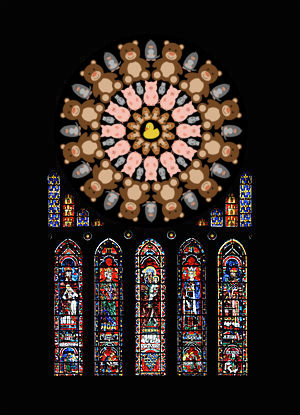

# The Great TikZlings Christmas Extravaganza 2019

This repository contains the souce code of the Great TikZlings Extravanganza 2019, created by ...
The full video is available from ...

Music and 3rd party images are not included in this repository. The links to the songs can be found in the file ./Storyboard2019/music.txt, links to 3rd party images are for the most part given in the code of the individual scenes.

| No. | Scenes                 | link to source code            | Resposible             | Music           |
| :---| :----------------------| :----------------------| :----------------------| :---------------|
|     | Cats                   |                        | samcarter              |                 |
|     | Hippos                 |./Ulrike/Hippos/hippos.tex| Ulrike              |                 |
|     | Wildwest               |./Ulrike/WildWest/wildwest.tex                  | Ulrike              |                 |

# First ideas

[link to pdf](./Storyboard/drafts/Extravaganza2019_storyboard.pdf)

## Hippos

Four Hippos (2 male, 2 female)
Music 1:00 - 1:20 
https://www.youtube.com/watch?v=3BPcImSZG8E

## Silent night (organ music)

Tikzling choir in front; 
background: 

Music 0:09 - 0.33 https://youtu.be/tUSVBQ7iNio

## And now for something different

https://youtu.be/Zk-kQSz-Qv0

## TUG / Rochester

Music:  Yankee Doodle; marching ducks with the Star Spangled Banner (maybe early version), background photo of Rochester
https://youtu.be/6HOc9WVZbts 0:36 - 0:50
Flag https://node01.flagstat.net/media/catalog/product/detail/2082.png

or

It seems there are some very impressive water falls in Rochester, e.g. 
https://commons.wikimedia.org/wiki/Category:High_Falls_of_the_Genesee_River#/media/File:Rochester_HighFalls_Night.JPG
Maybe a fearless tikzduck could swim there? 

## Cats / Remembering

Night sky, large moon with a mouse, a cat singing memories.

Music 0:00 - 0:20 https://youtu.be/8gd_ohoPzYc

## CTAN praise

A celebration of the CTAN team would be awesome, perhaps an office and a 
duck or another tikzling with those phone headsets and a computer to 
symbolize support... Then a huge gift with a card "with love, the LaTeX3 

I like Paulo's idea to make an office with computer etc. Maybe one could even 
add a tiny conveyor belt that runs into the computer with lots of ordinary 
brown packages and then a big and colourful L3 package between them. This 
could even use the cool duck gift paper from Ulrike  

Title "CTAN factory".  Packages that run into the computer and come out again 
as colorful packages would be nice.  

Factory noises
https://youtu.be/-Ih0JJLoMIg

or 

https://www.youtube.com/watch?v=A2Rj2UxJRtU

## Football 

Football in the middle; Gianna Nannini on top; football ducks around  
singing: 

> 1:25 - 1:55 https://youtu.be/9oU2XCi7fQA 

## Bat out of hell

Rockband/swirling bat
Musik: 
2:55 - 3:20
https://www.youtube.com/watch?v=Q9hLcRU5wE4

## Western town with marmot

background https://s-media-cache-ak0.pinimg.com/originals/5a/03/a5/5a03a528bae24b828b93524038952adc.jpg

Music 1:30 - 1:48
https://youtu.be/31zZL0V3r94

## Night divine 
nativity scene with ducks 

music 0:06 - 0:23 https://youtu.be/or2mMJ6_YCM

## Frightful weather

Sunny usland with palm tree, Snowman and penguins singing let is snow (it should then snow ...)

Music 0:08 - 0:20 https://youtu.be/vpyxTFqYHhE

## It's time to say goodbye

(not sure about this ..., a bit depressing)

Music 0:10 - 0:37
https://youtu.be/tL4spj1_trI

## Finale

traditional round of tikzlings, 

Music 0:08 - 0:27
https://youtu.be/h_5rpntGmwo
